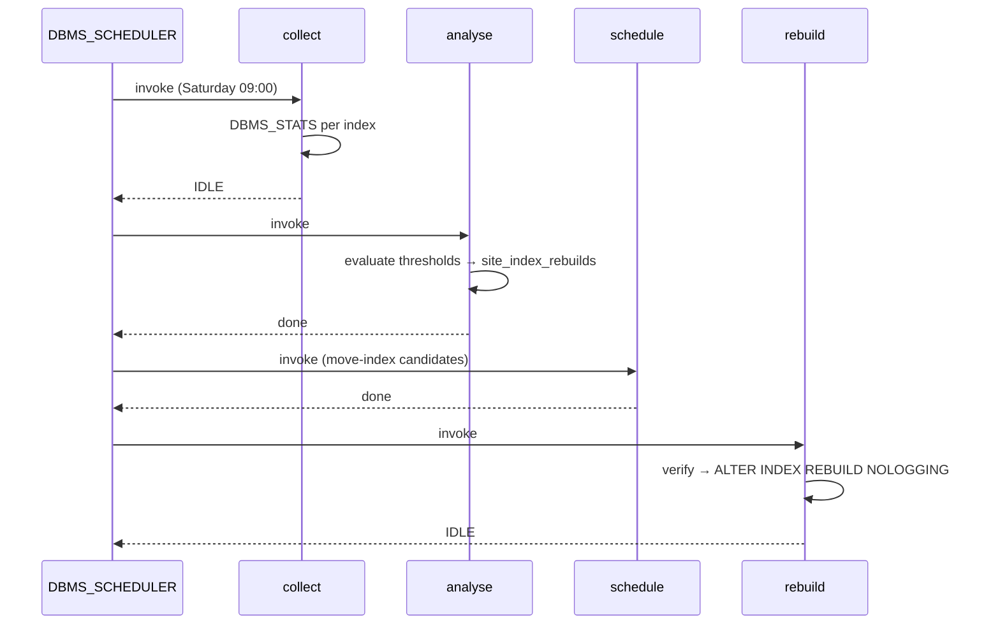
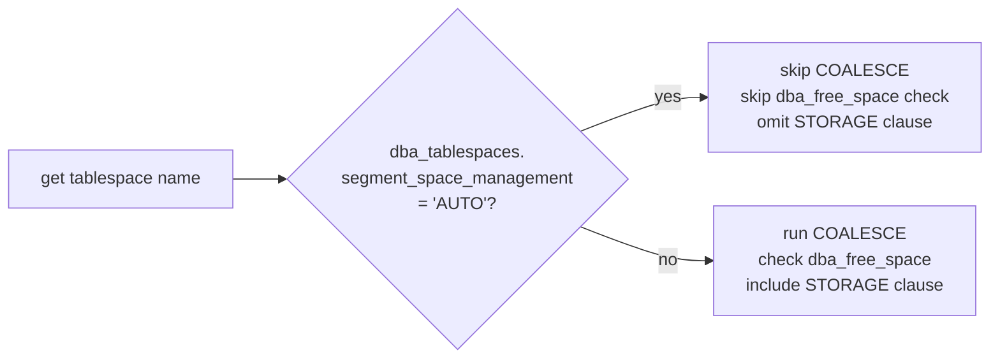

# Design Document: Oracle Index Tool Enhancement

## Overview

This enhancement modernises `indxtool.sql` — a PL/SQL index analysis and rebuild tool originally written for Oracle 8i/9i — to run correctly on Oracle 19c and later. The work falls into four categories:

1. **API modernisation**: Replace `ANALYZE INDEX … VALIDATE STRUCTURE` with `DBMS_STATS.GATHER_INDEX_STATS`, replace `DBMS_SQL` with `EXECUTE IMMEDIATE`, replace `DBMS_JOB` with `DBMS_SCHEDULER`, and remove deprecated DDL keywords (`UNRECOVERABLE`, `STORAGE` clauses, `BITMAP INDEX` on a low-cardinality column).
2. **Stub completion**: Implement the four procedures that currently contain only `NULL` bodies — `analyse`, `report`, `confirm`, and `select_tablespaces`.
3. **ASSM awareness**: Detect whether a tablespace uses Automatic Segment Space Management and skip extent-level free-space checks and `ALTER TABLESPACE … COALESCE` when it does.
4. **Time-constrained execution**: Add optional `v_end_time` / `v_max_minutes` parameters to long-running procedures so that a maintenance window deadline is respected.

The deliverable is a single revised `indxtool.sql` installation script, a companion test script `indxtool_test.sql`, and an updated `README.md`.

---

## Architecture

The tool remains a single Oracle PL/SQL package (`sitedba.index_tool`) installed by a SQL*Plus script. No application server, middleware, or external language is involved.

```
indxtool.sql          -- DDL + package spec + package body (revised)
indxtool_test.sql     -- Anonymous-block test suite
sitedba.sql           -- Schema/user creation (unchanged)
itstatus.sql          -- Ad-hoc status queries (unchanged)
README.md             -- User documentation (revised)
```

### Execution flow (weekly job)



### ASSM detection



---

## Components and Interfaces

### Package spec changes

All public procedure signatures gain two optional time-constraint parameters at the end:

```sql
PROCEDURE collect (
    v_schema      VARCHAR2 DEFAULT NULL,
    v_table       VARCHAR2 DEFAULT NULL,
    v_idx         VARCHAR2 DEFAULT NULL,
    v_trace_lvl   NATURAL  DEFAULT 0,
    v_end_time    DATE     DEFAULT NULL,
    v_max_minutes NUMBER   DEFAULT NULL
);

PROCEDURE analyse (
    v_schema      VARCHAR2 DEFAULT NULL,
    v_table       VARCHAR2 DEFAULT NULL,
    v_idx         VARCHAR2 DEFAULT NULL,
    v_trace_lvl   NATURAL  DEFAULT 0
);

PROCEDURE report (
    v_schema      VARCHAR2 DEFAULT NULL,
    v_table       VARCHAR2 DEFAULT NULL,
    v_idx         VARCHAR2 DEFAULT NULL,
    v_trace_lvl   NATURAL  DEFAULT 0
);

PROCEDURE confirm (
    v_schema      VARCHAR2 DEFAULT NULL,
    v_table       VARCHAR2 DEFAULT NULL,
    v_idx         VARCHAR2 DEFAULT NULL,
    v_trace_lvl   NATURAL  DEFAULT 0
);

PROCEDURE schedule (
    v_schema      VARCHAR2 DEFAULT NULL,
    v_table       VARCHAR2 DEFAULT NULL,
    v_idx         VARCHAR2 DEFAULT NULL,
    v_trace_lvl   NATURAL  DEFAULT 0
);

PROCEDURE rebuild (
    v_schema      VARCHAR2 DEFAULT NULL,
    v_table       VARCHAR2 DEFAULT NULL,
    v_idx         VARCHAR2 DEFAULT NULL,
    v_trace_lvl   NATURAL  DEFAULT 0,
    v_end_time    DATE     DEFAULT NULL,
    v_max_minutes NUMBER   DEFAULT NULL
);

PROCEDURE purge (
    v_purge_date  DATE    DEFAULT ADD_MONTHS(SYSDATE, -24),
    v_trace_lvl   NATURAL DEFAULT 0
);

PROCEDURE select_tablespaces (
    v_trace_lvl   NATURAL DEFAULT 0
);

FUNCTION get_site_param_value (
    v_domain VARCHAR2,
    v_name   VARCHAR2
) RETURN VARCHAR2;

PROCEDURE update_index_tool_control (
    v_program_id VARCHAR2,
    v_message    VARCHAR2
);

PROCEDURE update_index_tool_control (
    v_program_id VARCHAR2,
    v_status     VARCHAR2,
    v_message    VARCHAR2
);
```

### Private helpers (package body only)

```sql
-- Returns TRUE if tablespace uses ASSM
FUNCTION is_assm (v_tablespace_name VARCHAR2) RETURN BOOLEAN;

-- Resolves effective deadline from parameters or site_parameters
FUNCTION effective_end_time (
    v_end_time    DATE,
    v_max_minutes NUMBER
) RETURN DATE;

-- Returns TRUE if current time is past the deadline
FUNCTION deadline_exceeded (v_deadline DATE) RETURN BOOLEAN;

-- Existing private functions (retained)
FUNCTION verify (...) RETURN BOOLEAN;
FUNCTION index_tool_control_status (...) RETURN VARCHAR2;
```

### Procedure logic summaries

#### `collect` (modernised)
1. Resolve effective deadline via `effective_end_time`.
2. Check `index_tool_control` for QUIT/FAILED; return early if set.
3. Set status to RUNNING.
4. INSERT stub rows into `site_index_stats` for all matching segments not already SUBMITTED/RETRY (unchanged logic).
5. For each SUBMITTED/RETRY row in `cur_collect`:
   - If `deadline_exceeded(v_deadline)` → set status IDLE, commit, RETURN.
   - Skip partitioned indexes and IOTs (detect via `dba_indexes.index_type` and `dba_indexes.table_type`); record message, continue.
   - Call `DBMS_STATS.GATHER_INDEX_STATS(ownname => owner, indname => index_name)`.
   - Use `EXECUTE IMMEDIATE` to run `ANALYZE INDEX … VALIDATE STRUCTURE ONLINE` to populate `index_stats` view, then INSERT from `index_stats`.
   - Handle `resource_busy` with retry logic (unchanged).
6. Set status IDLE, commit.

> **Design note**: `DBMS_STATS.GATHER_INDEX_STATS` updates optimizer statistics but does not populate the `index_stats` virtual view. The `ANALYZE INDEX … VALIDATE STRUCTURE` command is still needed to populate `index_stats` for structural metrics (height, lf_rows, del_lf_rows, etc.). The modernisation replaces `DBMS_SQL` with `EXECUTE IMMEDIATE` for this call, and adds `DBMS_STATS` for optimizer statistics as an additional step. Requirement 1.1 is interpreted as: gather optimizer stats via `DBMS_STATS` *and* gather structural stats via `EXECUTE IMMEDIATE('ANALYZE INDEX … VALIDATE STRUCTURE ONLINE')`.

#### `analyse` (new implementation)
Mirrors the existing `schedule` procedure logic but is invoked as a separate, explicit analysis step:
1. For each index in `cur_schedule` (latest record per owner/name):
   - Check B-tree height threshold → insert SUBMITTED if exceeded.
   - Check PCT_DELETE + DISTINCTIVENESS thresholds → insert SUBMITTED if both exceeded.
   - Check PCT_USED vs historical average → insert SUBMITTED if below threshold.
   - Check AGE_THRESHOLD → insert SUBMITTED if no recent rebuild.
   - All inserts guarded by NOT EXISTS on non-COMPLETED entries.
2. Commit.

#### `report` (new implementation)
1. Open `cur_rpt` cursor (already defined in package spec).
2. For each row, emit via `DBMS_OUTPUT.PUT_LINE` in fixed-width format:
   ```
   OWNER          INDEX_NAME       HGT  %DEL  %USED  AVG%USED  STATUS
   ```
3. Apply `v_schema` / `v_idx` filters.
4. If no rows found, emit "No index statistics data available."

#### `confirm` (new implementation)
1. Display all SUBMITTED records (filtered by `v_schema`/`v_idx`) via `DBMS_OUTPUT`.
2. If both `v_schema` and `v_idx` are non-null: bulk-approve all matching SUBMITTED records (set status = VERIFIED, timestamp = SYSDATE) — suitable for scripted/scheduled use.
3. Commit.

> **Design note**: Interactive per-record approval (accept/reject prompts) is not feasible inside a stored procedure without SQL*Plus `ACCEPT` commands. The procedure therefore implements bulk-approval when both filter parameters are supplied, and display-only when they are not. A DBA can reject individual records by running a direct UPDATE.

#### `select_tablespaces` (new implementation)
1. Query `dba_tablespaces` for names matching `%INDEX%`, `%IDX%`, `%INDX%`, or ending with `X` → destination list.
2. Query `dba_tablespaces` for names matching `%DATA%` or ending with `D` → source list.
3. INSERT all source×destination pairs into `site_index_moves` where pair does not already exist.
4. If either list is empty, emit warning via `DBMS_OUTPUT.PUT_LINE`.
5. Commit.

#### `rebuild` (modernised)
1. Resolve effective deadline.
2. Check QUIT/FAILED; return early if set.
3. Set status RUNNING.
4. For each record in `cur_rebuild`:
   - If `deadline_exceeded(v_deadline)` → set status IDLE, commit, RETURN.
   - Call `is_assm(tablespace_name)`.
   - If NOT ASSM: `EXECUTE IMMEDIATE 'ALTER TABLESPACE … COALESCE'`.
   - Call `verify(record_id, tablespace_name, v_concat)` — which now also short-circuits for ASSM.
   - Build rebuild DDL:
     - Use `NOLOGGING` (not `UNRECOVERABLE`).
     - If ASSM: omit `STORAGE` clause.
     - If not ASSM: include `STORAGE (INITIAL … NEXT … MINEXTENTS … MAXEXTENTS … PCTINCREASE …)`.
   - `EXECUTE IMMEDIATE v_buff` (not `DBMS_SQL`).
   - Handle `resource_busy`, `lack_of_space`, `index_organised_table` as before.
5. Set status IDLE, commit.

#### `verify` (modernised)
1. Call `is_assm(v_tablespace_name)`.
2. If ASSM: set `v_concat := 'N'`, update status to VERIFIED, return TRUE immediately.
3. If not ASSM: existing `dba_free_space` logic unchanged.

#### `is_assm` (new private function)
```sql
FUNCTION is_assm (v_tablespace_name VARCHAR2) RETURN BOOLEAN IS
    v_ssm dba_tablespaces.segment_space_management%TYPE;
BEGIN
    SELECT segment_space_management
      INTO v_ssm
      FROM dba_tablespaces
     WHERE tablespace_name = UPPER(v_tablespace_name);
    RETURN v_ssm = 'AUTO';
EXCEPTION
    WHEN NO_DATA_FOUND THEN RETURN FALSE;
END is_assm;
```

#### `effective_end_time` (new private function)
```sql
FUNCTION effective_end_time (v_end_time DATE, v_max_minutes NUMBER)
    RETURN DATE IS
    v_param_end    VARCHAR2(30);
    v_param_mins   VARCHAR2(30);
BEGIN
    -- Explicit parameters take priority
    IF v_end_time IS NOT NULL THEN RETURN v_end_time; END IF;
    IF v_max_minutes IS NOT NULL THEN
        RETURN SYSDATE + v_max_minutes / 1440;
    END IF;
    -- Fall back to site_parameters
    BEGIN
        v_param_end := get_site_param_value('INDEX_TOOL','DEFAULT_END_TIME');
        RETURN TO_DATE(v_param_end, 'HH24:MI');  -- today at that time
    EXCEPTION WHEN OTHERS THEN NULL; END;
    BEGIN
        v_param_mins := get_site_param_value('INDEX_TOOL','DEFAULT_MAX_MINUTES');
        RETURN SYSDATE + TO_NUMBER(v_param_mins) / 1440;
    EXCEPTION WHEN OTHERS THEN NULL; END;
    RETURN NULL;  -- no deadline
END effective_end_time;
```

#### `deadline_exceeded` (new private function)
```sql
FUNCTION deadline_exceeded (v_deadline DATE) RETURN BOOLEAN IS
BEGIN
    RETURN v_deadline IS NOT NULL AND SYSDATE >= v_deadline;
END deadline_exceeded;
```

---

## Data Models

### Schema changes

#### `site_parameters` — new rows

| domain | name | value | purpose |
|---|---|---|---|
| `INDEX_TOOL` | `DEFAULT_END_TIME` | `NULL` | Wall-clock time (HH24:MI) after which long-running procedures exit gracefully |
| `INDEX_TOOL` | `DEFAULT_MAX_MINUTES` | `NULL` | Maximum runtime in minutes; converted to an end-time at procedure start |

These rows are inserted with `NULL` values so the feature is opt-in. When both are NULL and no explicit parameters are passed, no deadline is enforced.

#### `site_index_stats` — no structural changes required

The existing columns (`height`, `lf_rows`, `del_lf_rows`, `distinct_keys`, `pct_used`, etc.) are populated from the `index_stats` virtual view, which is still populated by `ANALYZE INDEX … VALIDATE STRUCTURE`. No new columns are needed.

#### DDL modernisation (no new tables)

- All `STORAGE (INITIAL … NEXT … PCTINCREASE …)` clauses removed from `CREATE TABLE` and `CREATE INDEX` statements.
- `BITMAP INDEX site_index_stats_n2` replaced with a B-tree index.
- All `CREATE TABLE` / `CREATE INDEX` / `CREATE SEQUENCE` statements wrapped in idempotent guards:
  ```sql
  BEGIN
      EXECUTE IMMEDIATE 'CREATE TABLE ...';
  EXCEPTION
      WHEN OTHERS THEN
          IF SQLCODE != -955 THEN RAISE; END IF; -- ORA-00955: name already used
  END;
  /
  ```
- `connect / as sysdba` removed; replaced with a comment instructing the DBA to connect before running.

### `DBMS_SCHEDULER` job definition

```sql
BEGIN
    -- Drop if exists (idempotent)
    BEGIN
        DBMS_SCHEDULER.DROP_JOB('SITEDBA.INDEX_TOOL_WEEKLY', force => TRUE);
    EXCEPTION WHEN OTHERS THEN NULL;
    END;

    DBMS_SCHEDULER.CREATE_JOB(
        job_name        => 'SITEDBA.INDEX_TOOL_WEEKLY',
        job_type        => 'PLSQL_BLOCK',
        job_action      => 'BEGIN
                               sitedba.index_tool.collect;
                               sitedba.index_tool.analyse;
                               sitedba.index_tool.schedule;
                               sitedba.index_tool.rebuild;
                           END;',
        start_date      => NEXT_DAY(TRUNC(SYSDATE), 'SATURDAY') + 9/24,
        repeat_interval => 'FREQ=WEEKLY;BYDAY=SAT;BYHOUR=9;BYMINUTE=0;BYSECOND=0',
        enabled         => TRUE,
        comments        => 'Weekly index analysis and rebuild job'
    );
END;
/
```

---

## Correctness Properties

*A property is a characteristic or behavior that should hold true across all valid executions of a system — essentially, a formal statement about what the system should do. Properties serve as the bridge between human-readable specifications and machine-verifiable correctness guarantees.*

